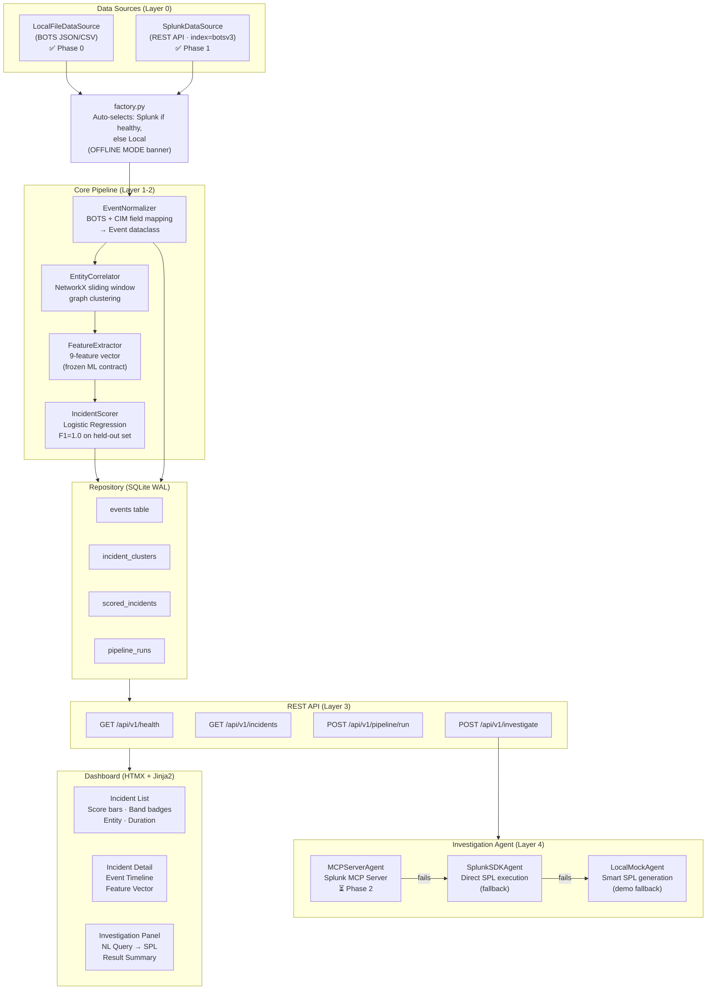
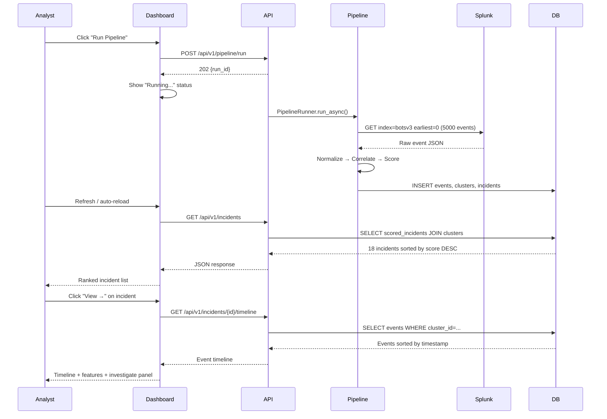

# SentinelLens — System Architecture

## Overview

SentinelLens is built around a strict layered architecture with one load-bearing rule:
**no component downstream of the DataSource interface may import `local.py` or `splunk.py` directly.**
This single constraint makes Phase 0 a fully standalone deliverable independent of Splunk.

---

## Full System Diagram



---

## Request Flow (End to End)



---

## Component Dependency Map

```
Module                  May Import From              May NOT Import From
────────────────────────────────────────────────────────────────────────
api/routes/*.py      →  pipeline/, db/, models.py   datasource/local.py directly
pipeline/correlator  →  models.py, features.py      datasource/*, db/*, agent/*
pipeline/scorer      →  models.py, features.py      datasource/*, db/*, api/*
pipeline/normalizer  →  models.py, datasource/base  datasource/local.py directly
datasource/splunk    →  datasource/base, models.py  pipeline/*, db/*, api/*
agent/mcp_agent      →  agent/base, models.py       datasource/*, pipeline/*
```

---

## Data Flow

```
Raw Events (JSON/CSV or Splunk)
        │
        ▼
  EventNormalizer
  ├── _time → UTC datetime
  ├── entity_id → "user:alice", "host:dc01", "ip:10.0.0.1"
  ├── event_type → CIM-normalized
  └── severity → 1-5
        │
        ▼
  EntityCorrelator (NetworkX)
  ├── Sort by timestamp
  ├── Group by entity_id
  ├── Add edges within 15-min window
  ├── connected_components() → clusters
  └── Filter: min_size=2, cap=500
        │
        ▼
  FeatureExtractor (9 features)
  ├── event_count, event_type_entropy
  ├── severity_sum, severity_max
  ├── entity_fan_out, time_density
  ├── time_span_minutes, unique_sources
  └── perf_deviation_max (optional)
        │
        ▼
  IncidentScorer (Logistic Regression)
  ├── predict_proba() → 0.0–1.0
  └── HIGH ≥0.75 | MEDIUM ≥0.50 | LOW <0.50
        │
        ▼
  SQLite Repository → REST API → HTMX Dashboard
```

---

## Technology Stack

| Layer | Technology | Version | Justification |
|-------|-----------|---------|---------------|
| Runtime | Python | 3.11+ | scikit-learn/networkx ecosystem |
| API Server | Flask | 3.0.3 | Minimal overhead, fast to build |
| Graph Clustering | NetworkX | 3.3 | Native connected_components algorithm |
| ML Scoring | scikit-learn | 1.5.1 | LR + GBT, joblib serialization |
| Storage | SQLite WAL | built-in | Zero deployment overhead |
| Frontend | HTMX + Jinja2 | 1.9+ | No React build step needed |
| Splunk Integration | REST API | v1 | Direct HTTP, avoids SDK parser issues |
| MCP Server | Splunk MCP | 1.3.1 | Hackathon bounty target |

---

## Deployment

```
┌─────────────────────────────────────────────────┐
│  Developer Machine / Demo Environment            │
│                                                  │
│  ┌─────────────────┐   ┌─────────────────────┐  │
│  │  SentinelLens   │   │   Splunk Enterprise  │  │
│  │  Flask :5000    │◄──│   localhost:8000     │  │
│  │  SQLite WAL     │   │   REST API :8089     │  │
│  │                 │   │   index=botsv3       │  │
│  └─────────────────┘   │   MCP Server v1.3.1  │  │
│                        └─────────────────────┘  │
│                                                  │
│  make demo → http://localhost:5000               │
│  Login: admin / admin123                         │
└─────────────────────────────────────────────────┘
```
